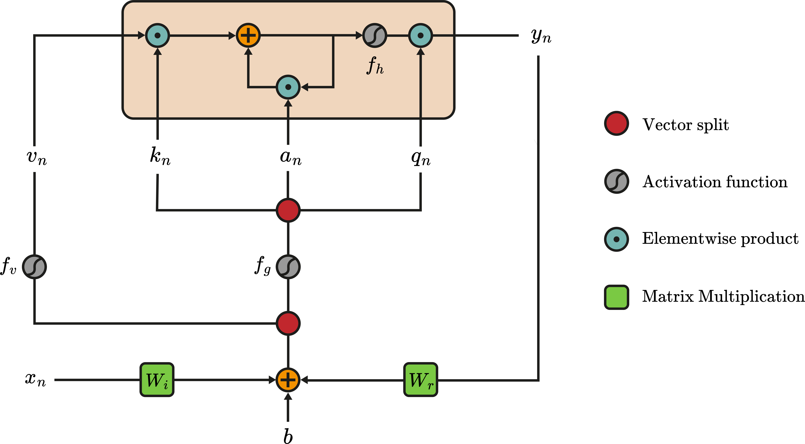
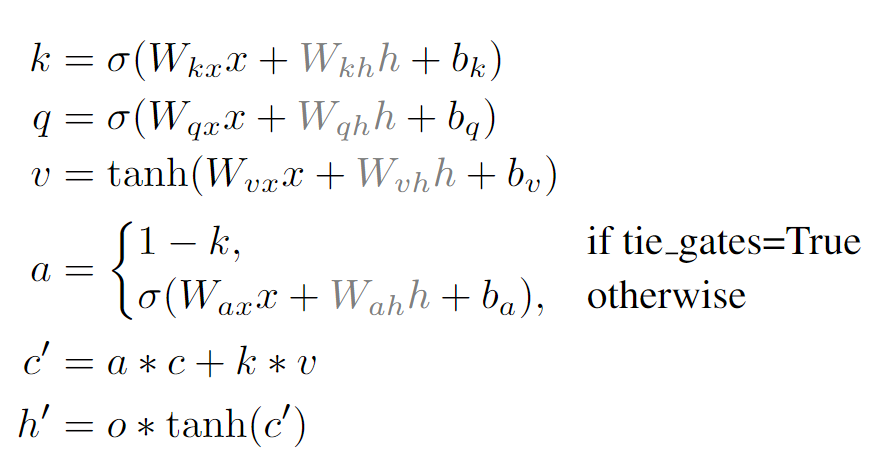

# GatedLinearRNN

<div style="display: flex; justify-content: space-around; align-items: center;">
    
    
</div>

> **GatedLinearRNN: Fully Data-Controlled Linear Recurrence for Sequence Modeling**\
> Tobias Katsch*\
> Paper: https://arxiv.org/abs/2311.01927
>

## About

Linear Gated RNNs (Mamba, GateLoop, HGRN) are a novel class of sequence model which generalizes linear recurrent 
models such as S4, S5, LRU and RetNet, by employing data-controlled state transitions. 
While having a low cost linear complexity inference mode, they can be trained extremely 
efficient in parallel with logarithmic complexity making use of the highly optimized JAX 
associative scan implementation. This repository implements a practical gated linear recurrent model with default 
choices for input-, hidden- and gate activations and provides a drop-in replacement for causal multi-head-attention 
and a linear gated RNN language model architecture. Furthermore, linear gated RNNs can be used to train true recurrent 
models (GRU, LSTM) extremely fast by first training using associative scans and switching to a true recurrent mode 
(by enabling recurrent weights) for finetuning.

## Installation

- `pip install flax-gated-linear-rnn`:

Other requirements:
- JAX 0.4.20+
- FLAX 0.8.0+

## Usage
We provide 2 main modules:
- ### [gated_linear_rnn.py](flax_gated_linear_rnn/gated_linear_rnn.py)
  A causal time mixing sequence model which can be used as a drop-in replacement for causal multi-head-attention.
  Usage:
  ```
  import jax
  import jax.numpy as jnp
  from flax import linen as nn
  from flax_gated_linear_rnn import GatedLinearRNN
  
  batch_size, sequence_length, input_dim, d_h = 2, 64, 16, 32
  key = jax.random.PRNGKey(0)
  x = jax.random.normal(key, (batch_size, sequence_length, input_dim))
  
  model = GatedLinearRNN(
      d_h=d_h,
      input_activation=nn.tanh,
      hidden_activation=nn.tanh,
      gate_activation=nn.sigmoid,
      use_true_recurrence=False,
      use_tied_gates=True,
  )
  
  params = model.init(jax.random.PRNGKey(1), x)
  carry, y = model.apply(params, x, carry=None)
  assert y.shape == (batch_size, sequence_length, d_h)
  assert carry.shape == (batch_size, d_h)
  ```
  `carry` holds the hidden model state, which can be used for fast linear complexity autoregressive inference.
  #### Two Stage Training
  - **Associative Recurrent Mode:** (`use_true_recurrence=False`) Extremely efficient training through associative scan. This disables the recurrent weights, allowing for much faster training compared to Transformer, GRU & LSTM.
  - **True Recurrent Mode:** (`use_true_recurrence=True`) Can be used to train a more expressive model from a Linear Recurrent Model checkpoint. This variant introduces additional parameters such that the inputs and gates also depend on previous hidden states similar to GRU & LSTM. Due to the true recurrent nature, this mode cannot be parallelized and thus is less efficient. We recommend this for finetuning from an linear recurrent checkpoint.

  #### Gate Tying
  - **Disjoint Input & Forget gate** (`use_tied_gates=False`) Applies seperate projections for input- & forget gates
  - **Tied Input & Forget gate** (`use_tied_gates=True`) Ties the input and forget gate through the relation `forget_gate = 1-input_gate`.


- ## [gated_linear_rnn_lm.py](flax_gated_linear_rnn/language_models/gated_linear_rnn_lm.py)
  A GatedLinearRNN-based language model.
  ```
  import jax
  import jax.numpy as jnp
  from flax import linen as nn
  from flax_gated_linear_rnn import GatedLinearRNNLM
  
  # Model parameters
  n_layer = 4
  d_model = 256
  d_channel_mixing = 64
  eps = 1e-6
  channel_mixing_dropout = 0.1
  time_mixing_dropout = 0.1
  input_vocab_size = 10000
  output_vocab_size = 10000
  max_seq_length = 512
  embedding_dropout = 0.1
  use_word_embedding = True
  positional_encoding_mode = 'none'  # 'none', 'learned', 'sinusoidal'
  d_h = 256
  
  model = GatedLinearRNNLM(
    n_layer=n_layer,
    d_model=d_model,
    d_channel_mixing=d_channel_mixing,
    eps=eps,
    channel_mixing_dropout=channel_mixing_dropout,
    time_mixing_dropout=time_mixing_dropout,
    input_vocab_size=input_vocab_size,
    output_vocab_size=output_vocab_size,
    max_seq_length=max_seq_length,
    embedding_dropout=embedding_dropout,
    use_word_embedding=use_word_embedding,
    positional_encoding_mode=positional_encoding_mode,
    d_h=d_h,
    input_activation=nn.tanh,
    hidden_activation=nn.tanh,
    gate_activation=nn.sigmoid,
    use_true_recurrence=False,
    use_tied_gates=True,
  )
  
  # Sample input
  batch_size = 32
  x = jax.random.randint(jax.random.PRNGKey(0), (batch_size, max_seq_length), 0, input_vocab_size)
  
  # Initialize and apply model
  params = model.init(jax.random.PRNGKey(2), x, training=False)
  carry, y = model.apply(params, x, training=True, carry=None, rngs={'dropout': jax.random.PRNGKey(0)})
  assert y.shape == (batch_size, max_seq_length, output_vocab_size)
  assert carry.shape == (batch_size, n_layers, d_h)
  ```
  `carry` holds the hidden GatedLinearRNN model states for all layers which can be used for fast linear complexity autoregressive inference.

## Citation

If you use this codebase, please cite:
```
@misc{katsch2024GatedLinearRNN,
      title={GatedLinearRNN: Fully Data-Controlled Linear Recurrence for Sequence Modeling}, 
      author={Tobias Katsch},
      year={2024},
      eprint={2311.01927},
      archivePrefix={arXiv},
      primaryClass={cs.LG}
}
```
